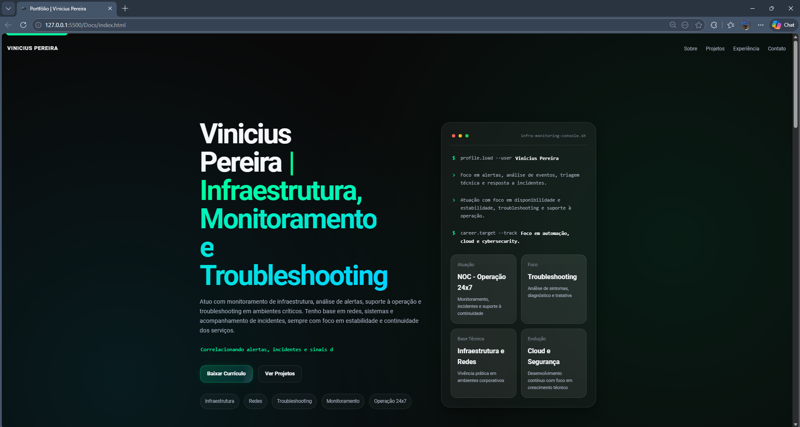

# Portfólio Web Profissional

Site de portfólio profissional desenvolvido para apresentar minha trajetória, competências técnicas e projetos práticos na área de TI, com foco em infraestrutura, monitoramento, suporte e operações.



## Sobre o projeto

Este projeto foi criado com o objetivo de reunir, em um único ambiente web, minha apresentação profissional, destacando experiência prática em infraestrutura, redes, monitoramento de ambientes, troubleshooting e evolução contínua em cloud e cybersecurity.

## Funcionalidades

- Navegação por seções
- Layout responsivo para desktop e mobile
- Seção inicial com apresentação profissional e chamadas de ação
- Blocos de competências organizados por área técnica
- Timeline de experiência profissional
- Cards de projetos e labs práticos
- Links diretos para contato, LinkedIn e GitHub
- Favicon personalizado

## Tecnologias utilizadas

- HTML5
- CSS3
- JavaScript
- Design responsivo

## Estrutura do projeto

```bash
Portifolio-Web/
├── Docs/
│   ├── images/
│   ├── index.html
│   ├── script.js
│   └── style.css
├── LICENSE
└── Readme.md

Como visualizar o projeto
1. Clone o repositório
git clone https://github.com/vinips04/Portifolio-Web.git
2. Acesse a pasta do projeto
cd Portifolio-Web/Docs
3. Abra no navegador

Você pode visualizar o projeto de duas formas:

abrindo o arquivo index.html diretamente no navegador
utilizando a extensão Live Server no VS Code
Evidências

As imagens, capturas de tela e outros arquivos visuais do projeto podem ser organizados na pasta:

/Docs/images/


Melhorias futuras
Deploy com GitHub Pages
Inclusão de novos projetos
Melhorias visuais e animações
Versão bilíngue
Integração com currículo em PDF

Autor

Vinicius Pereira
Analista de TI | Infraestrutura, Monitoramento e Suporte

LinkedIn: https://www.linkedin.com/in/viniciuspereira27/
GitHub: https://github.com/vinips04/